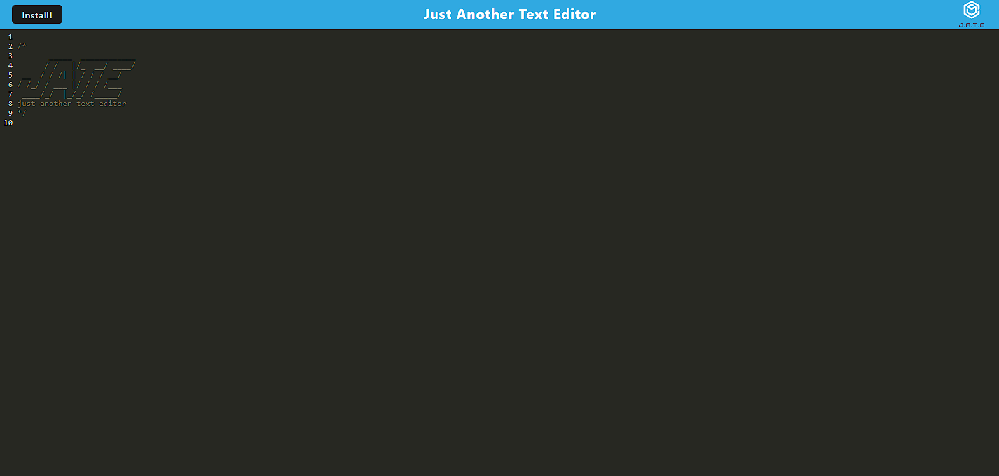

# text-editor

## Description

The PWA Text Editor is a web application designed to provide a seamless text editing experience, incorporating Progressive Web App (PWA) principles for offline functionality and data persistence. The motivation behind this project is to showcase advanced concepts learned in a coding course and to create a practical tool for developers who want to take notes or write code snippets with or without an internet connection.

## Installation

To set up the PWA Text Editor locally, follow these steps:

1. Clone the repository

2. Install dependencies:

    `npm i`

3. Start the application:

    `npm start`

## Preview 

## Features

- **Data Persistence:** IndexedDB is employed for efficient storage and retrieval of content, ensuring data persistence.
- **Offline Functionality:** The text editor seamlessly functions offline, allowing users to continue their work without an internet connection.

👋 Hi, I'm Gary, a student passionate about web development.

- 🔭 Currently exploring the world of web technologies.
- 🌱 Learning and building projects to enhance my skills.
- 💬 Let's connect! Feel free to reach out to me on [GitHub](https://github.com/garym636).